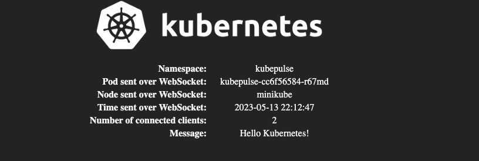

# KubePulse



KubePulse is a simple, resource efficient cluster test application for Kubernetes. It displays basic information about the node/pod that served the webpage, and also sends the time continuously over a websocket.

## Installation

Installation is done via Helm.

```
helm repo add kubepulse https://cmdrsharp.github.io/kubepulse
helm install kubepulse kubepulse/kubepulse
```

See [values.yaml](charts/kubepulse/values.yaml) for a comprehensive list of values that can be set. Typically, you may want to enable an ingress. The helm chart supports native ingress manifests and optionally allows deploying an Istio VirtualService.
